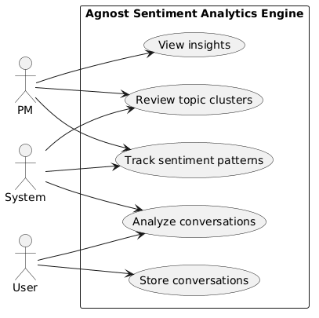
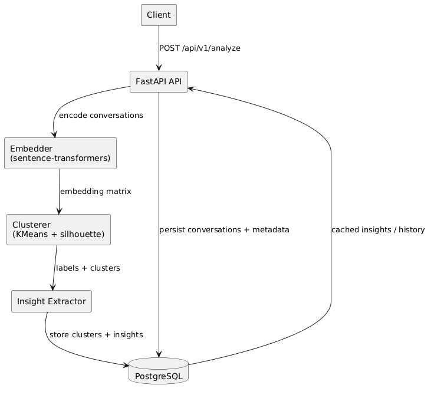
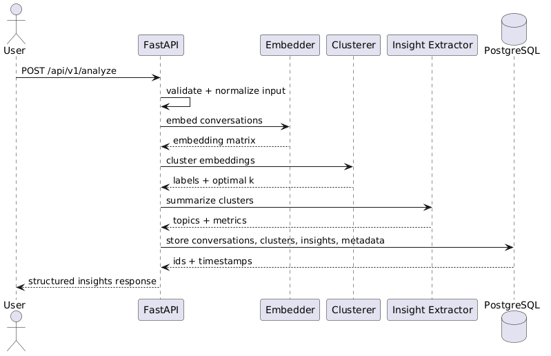
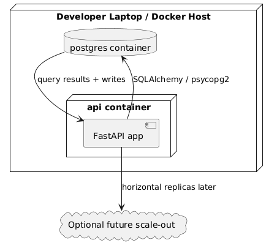

# Agnost AI Sentiment Analytics Engine

FastAPI service that clusters user conversations, identifies sentiment patterns, and generates quantified product insights for PM and support teams.

## What it does

- Clusters conversations by semantic topic using sentence-transformer embeddings and KMeans.
- Labels each cluster with a product-facing topic and dominant sentiment.
- Stores conversations, clusters, insights, and analysis metadata in PostgreSQL.
- Returns quantified insights such as "23% of conversations mention pricing concerns."
- Starts with one command through Docker Compose.

## Quick Start

```bash
docker-compose up
```

The API runs at `http://localhost:8000` and the interactive docs are available at `http://localhost:8000/docs`.

## Example API Calls

### Analyze conversations

```bash
curl -X POST http://localhost:8000/api/v1/analyze \
	-H "Content-Type: application/json" \
	-d '{
		"conversations": [
			"User: Product is too expensive",
			"User: Love this tool!",
			"User: Getting errors on login"
		],
		"force_recompute": false,
		"num_clusters": null
	}'
```

### Store conversations in batch

```bash
curl -X POST http://localhost:8000/api/v1/conversations/batch \
	-H "Content-Type: application/json" \
	-d '{
		"conversations": [
			"User: need a refund",
			"User: can you add Slack integration"
		],
		"source": "support_chat"
	}'
```

### Read cached insights

```bash
curl "http://localhost:8000/api/v1/insights?limit=10&offset=0"
```

### Health check

```bash
curl http://localhost:8000/health
```

## Local Development

```bash
python -m venv .venv
source .venv/bin/activate
pip install -r requirements.txt
python main.py
```

By default the app uses SQLite locally. Set `DATABASE_URL` to a PostgreSQL DSN when you want to run against a real database.

## Project Structure

- `main.py` - Application entry point.
- `api/` - FastAPI routes and Pydantic schemas.
- `clustering/` - Embeddings, KMeans clustering, and insight generation.
- `db/` - SQLAlchemy models, connection helpers, migrations, and schema reference.
- `utils/` - Logging, cache, and custom errors.
- `data/sample_conversations.json` - Diverse sample conversations for smoke testing.
- `REASONING.md` - Architectural decisions, alternatives, and trade-offs.
- `DIAGRAMS.md` - PlantUML diagrams for the system.

## System Diagrams

Below are visual diagrams that summarize the system from different perspectives. Use these on calls to explain actors, data flow, request sequencing, and deployment.

### 1) Use Case



This diagram shows the three primary actors (Users, PMs, and the System) and the key use cases: Analyze conversations, Store conversations, View insights, Review topic clusters, and Track sentiment patterns. It emphasizes who produces data and who consumes the insights.

### 2) System Architecture



This architecture diagram follows the linear data path: Client → FastAPI → Embedder → Clusterer → Insight Extractor → PostgreSQL. The ML steps are intentionally isolated from persistence and API transport to keep components testable and replaceable.

### 3) Sequence Diagram



This sequence shows the lifecycle of an `/api/v1/analyze` request: validate & normalize, embed, cluster, summarize, persist, and respond. It highlights the synchronous compute steps that are candidates for backgrounding if throughput becomes a concern.

### 4) Deployment Diagram



The deployment diagram illustrates the simple two-container setup used for demos: one API container and one PostgreSQL container. This minimal footprint simplifies local demos while retaining a clear path to horizontal scaling.

## Notes

- The embedding model defaults to `all-MiniLM-L6-v2`.
- The clustering step searches for a reasonable `k` automatically with silhouette scoring.
- The insight extractor intentionally favors explainability over heavy summarization.
